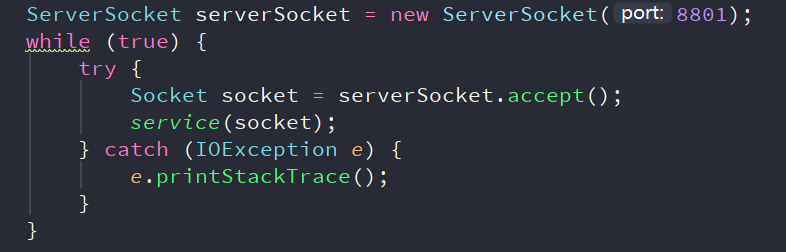
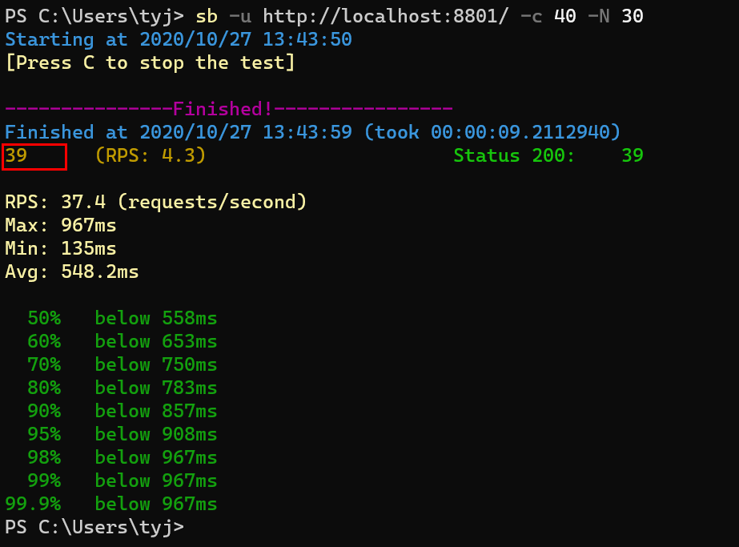
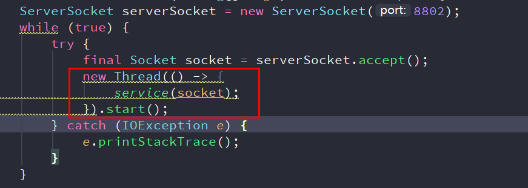
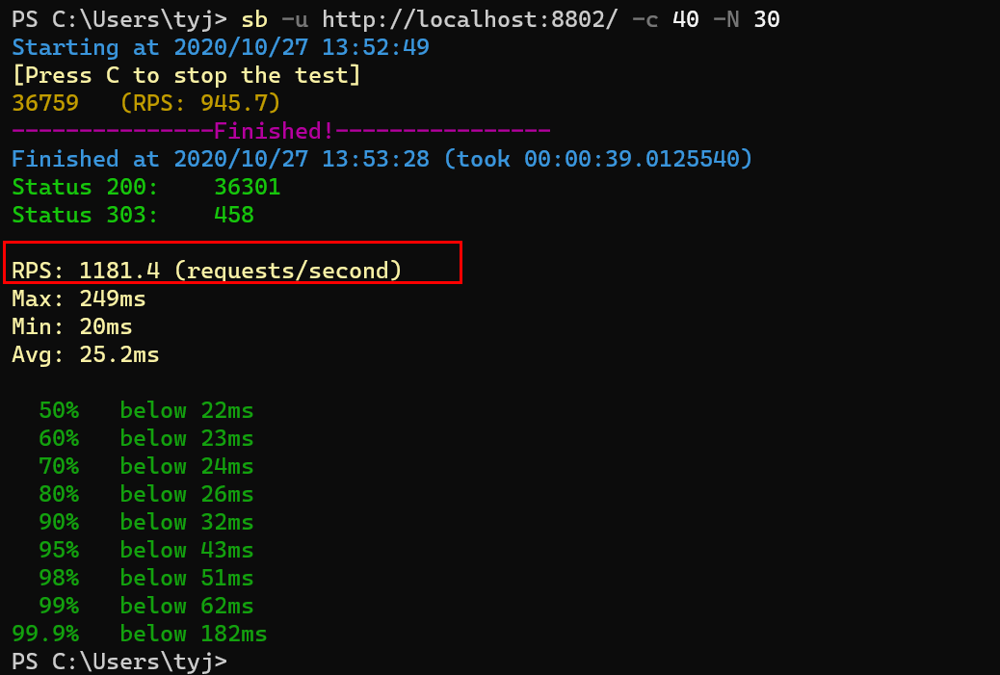
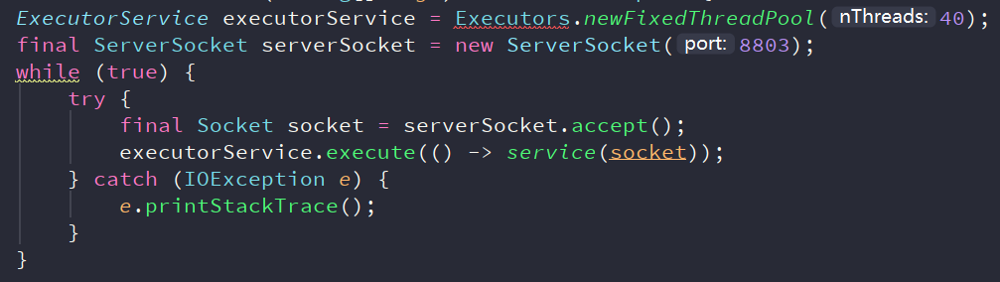
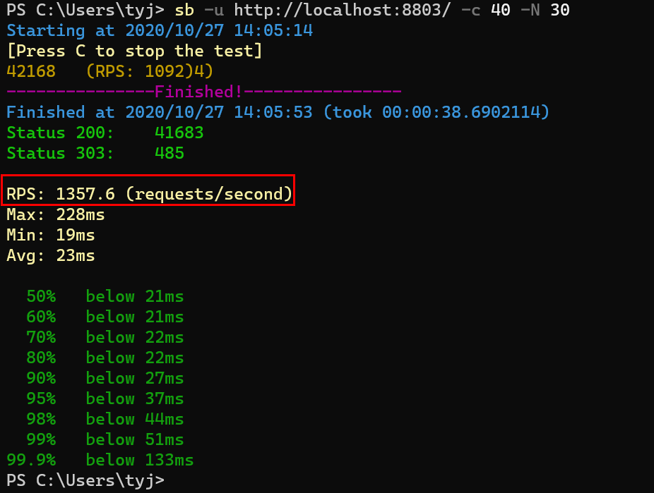
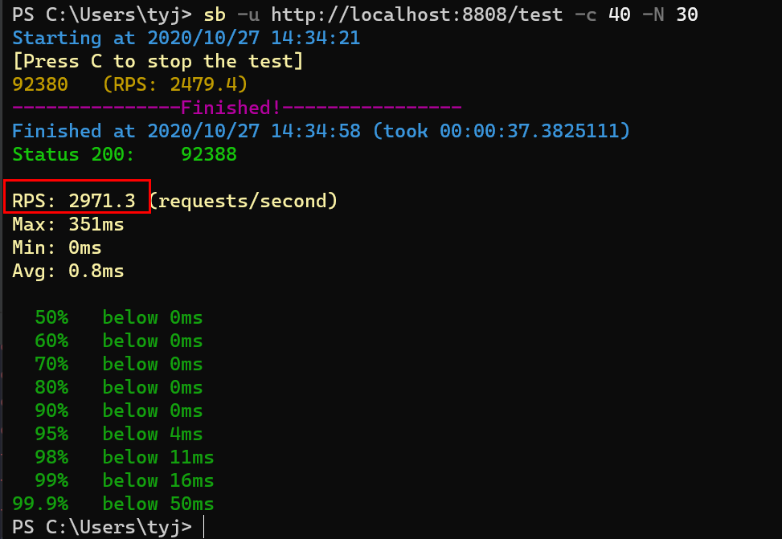

## 1.运行httpServer01(串行）

**压测结果：**

**分析：** 可以看出吞吐量是37，应该是一个比较低的值，原因就是在于这是一个单线程的程序，不管多少个请求进来，你都必须等前面的请求处理完了才会来处理你的请求，所以我们也可以直观看到最大的等待时间长达接近1秒。

## 2.运行httpServer02（多线程版本）

**压测结果：**

**分析：** 我们可以看到这个吞吐量一下子就上来了好多倍，因为采用了多线程机制，主线程永远都不会等待，每一个请求进来都会新创建一个线程去做处理。

## 3.运行httpServer03（线程池版本）

**压测结果：**

**分析：** 我们可以看到压测结果显示线程池的吞吐量又是要大于多线程的吞吐量的。我觉得有两个原因。一是线程池一经创建就可以使用，避免了像纯多线程那样一直创建销毁所带来的的消耗。二是线程池维护一些固定数量的线程，不像纯多线程那样有大量的线程在抢占CPU，所以线程之间的切换（保存上下文）所带来的消耗是非常巨大的。

## 4.Netty例子
**简单运行结果：**

**压测结果：**

**分析：** 可以看到netty的性能基本上竟然是线程池方式的两倍，为什么呢，因为netty是一个异步非阻塞的框架，并且使用了IO多路复用技术，通过查阅资料了解了下IO多路复用技术，大概就是可以用很少的线程去监听所有的套接字，只要数据准备好了，就发起真正的系统调用去做IO。
